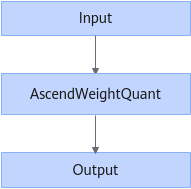

# DeleteNoConstFolding

## Description

Deletes the `ATTR_NO_NEED_CONSTANT_FOLDING` tag if it exists on the AscendWeightQuant operator when the structure shown in the following figure is identified.

## Constraints

None

## Applicable Products

<!-- npu="950" id1 -->
950PR/950DT
<!-- end id1 -->
