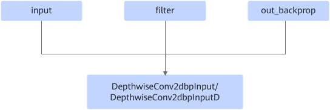
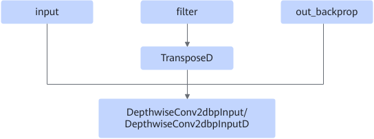

# DepthwiseDfFusionPass

## Description

Adds the TransposeD operator before the DepthwiseConv2DbackpropInput convolution operator to improve computing performance.

Before:  After:

## Constraints

This fusion takes effect only when the filter format is NCHW.
