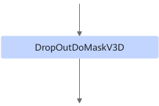
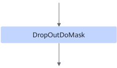

# DropOutDoMaskFusionPass

## Description

Replaces the DropOutDoMaskV3D operator with DropOutDoMask.

After fusion, the DropOutDoMaskV3D operator is replaced with the DropOutDoMask operator. The DropOutDoMask operator can be implemented through the DSL branch using the Elemwise template and supports UB fusion.

After:

## Constraints

- When the DSA module is supported, the fusion patterns take effect and must be enabled.
- Fusion patterns must be enabled when the DropOutDoMask operator is used for UB fusion.
- One of the parent nodes of DropOutDoMaskV3D must be DSAGenBitMask, which is used as the mask input.

## Applicable Products

<!-- npu="910b" id1 -->
Atlas A2 training products/Atlas A2 inference products
<!-- end id1 -->

<!-- npu="A3" id2 -->
Atlas A3 training products/Atlas A3 inference products
<!-- end id2 -->
