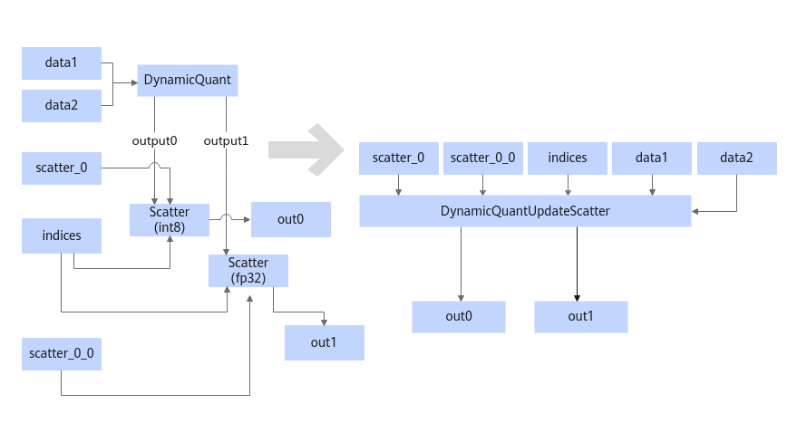
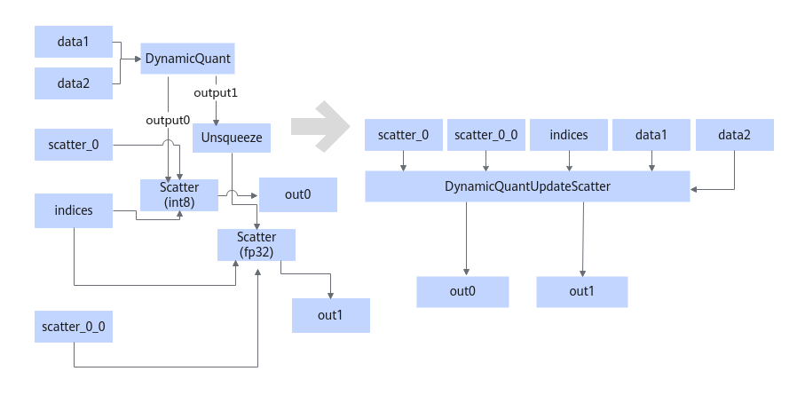
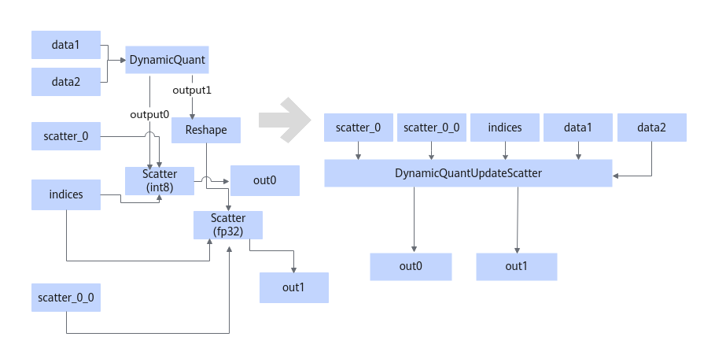

# DynamicQuantUpdateScatterFusionPass

## Description

Fuses the structure that meets the following patterns into the DynamicQuantUpdateScatter operator.

or

or

## Constraints

- Two outputs of DynamicQuant are required, each being output to the Scatter operator. The two Scatter operators share one **indices** input and have the same **axis**, but their **input0** are from different nodes.
- **output0** of DynamicQuant is of int8 data type, and **output1** is of fp32 data type.
- The input **dtype** of DynamicQuant must be float16 or bfloat16, and **input1** must exist. The shape of **input1** must be 1-dimensional and equal to the last dimension of **input0**.
- The output of DynamicQuant is used as the input of the third **update** of Scatter.

## Applicable Products

<!-- npu="910b" id1 -->
Atlas A2 training products/Atlas A2 inference products
<!-- end id1 -->
