# EinsumPass

## Description

Constructs a computational graph based on the expression of the Einsum operator. As shown in the following figure, the dotted-line nodes in the computational graph indicate that operators may be added based on the actual expression.

- For **static shapes**, there are two cases:

  Static shape and single input:

  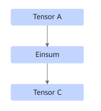

  After:

  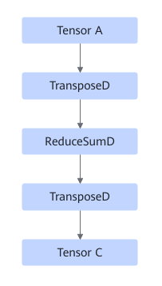

  Static shape and dual inputs (Depending on the specific expression, the two inputs of the MatMul operator may be swapped):

  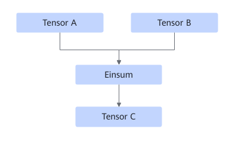

  After:

  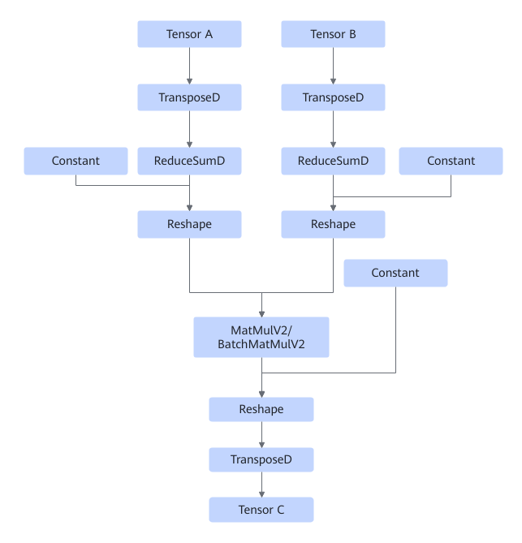

- For **dynamic shapes**, the graph to which the Einsum operator belongs before fusion has dual inputs, as shown in the following figure:

  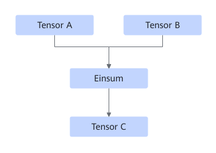

  Currently, 14 types of expressions are supported for dynamic shapes. The following figures show the graphs after fusion.

 1. The Einsum expression is in the form of "abc,cde->abde":

    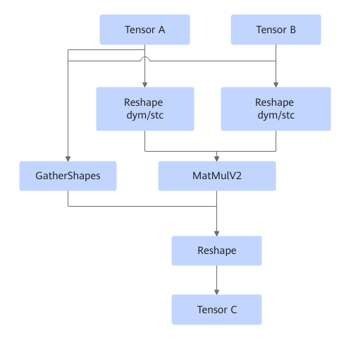

 2. The Einsum expression is in the form of "abcd,aecd->aceb" (the two inputs of the BatchMatMul operator are swapped):

    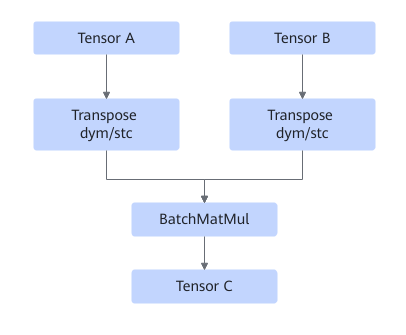

 3. The Einsum expression is in the form of "abcd,adbe->acbe":

    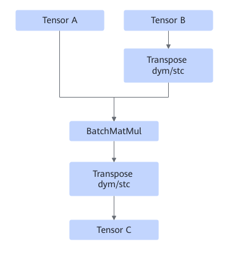

 4. The Einsum expression is in the form of "abcd,cde->abe":

    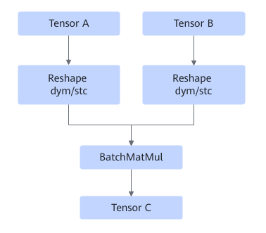

 5. The Einsum expression is in the form of "abc,cd->abd":

    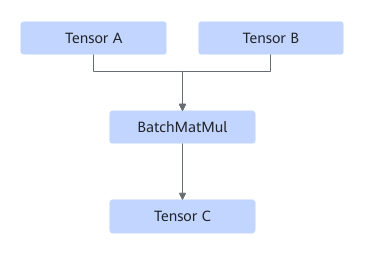

 6. The Einsum expression is in the form of "abc,dc->abd":

    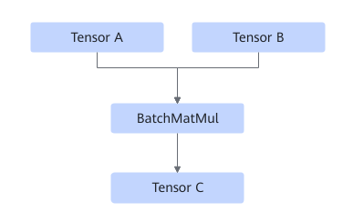

 7. The Einsum expression is in the form of "abc,abd->dc" (the two inputs of the MatMulV2 operator are swapped):

    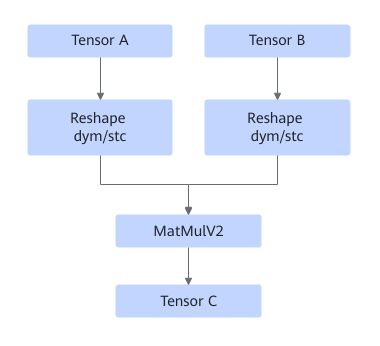

 8. The Einsum expression is in the form of "abc,dec->abde":

    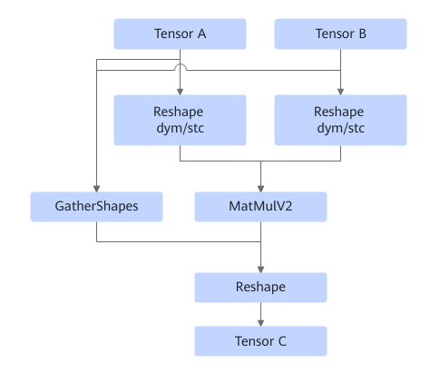

 9. The Einsum expression is in the form of "abc,abde->dec":

    TensorB with a static shape: 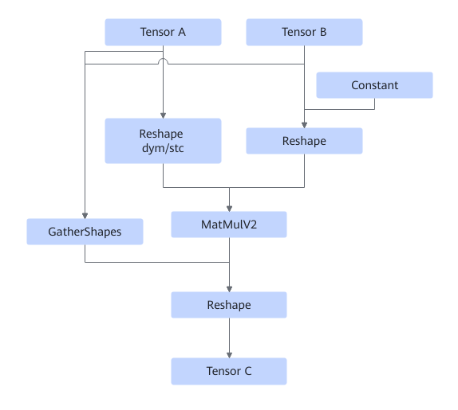

    Tensor B with a dynamic shape:

    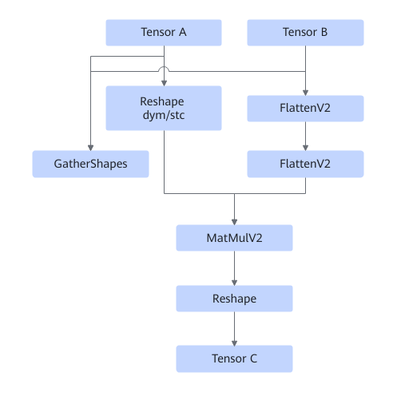

10. The Einsum expression is in the form of "abcd,aecd->acbe":

    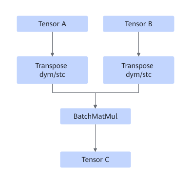

11. The Einsum expression is in the form of "abcd,acbe->aecd":

    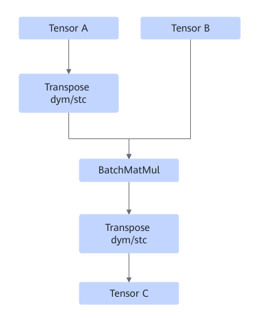

12. The Einsum expression is in the form of "abcd,ecd->abe":

    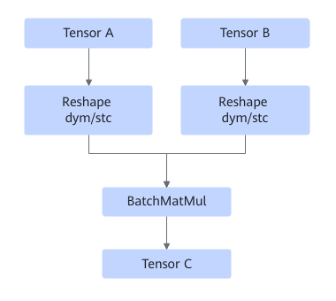

13. The einsum expression is in the form of "abcd,abe->ecd":

    Tensor A with a static shape:

    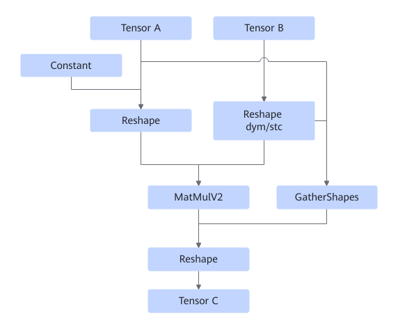

    Tensor A with a dynamic shape:

    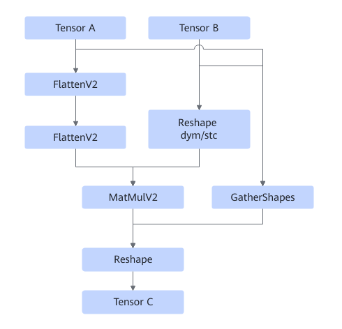

14. The Einsum expression is "abcd,acbe->adbe":

    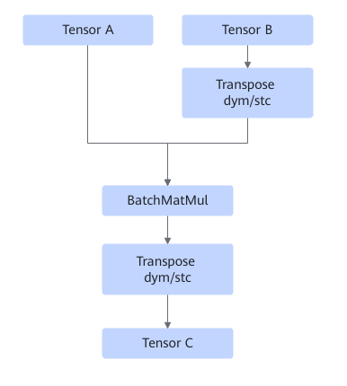

    Based on whether the input shape is dynamic, the **Reshape dym/stc** node contains the operators shown in the following figure.

    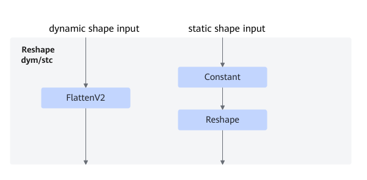

    Based on whether the input shape is dynamic, the **Transpose dym/stc** node contains the operators shown in the following figure.

    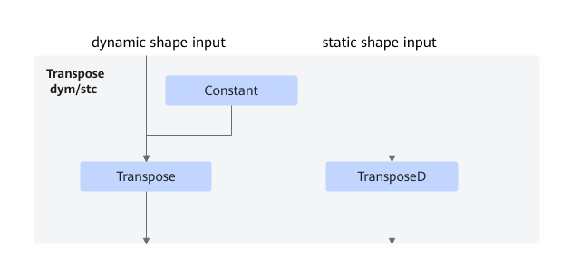

- The Einsum expression is in the form of "abcd, abde->abce":

    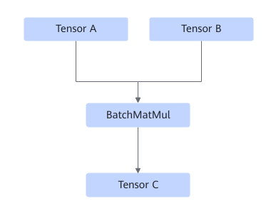

- The Einsum expression is in the form of "abcd, abce->abde":

    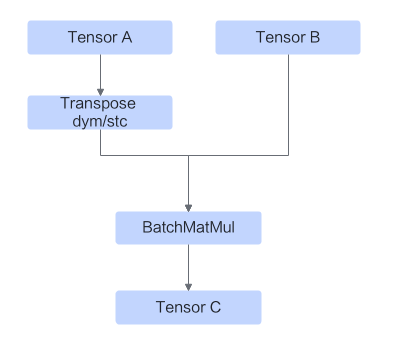

    Based on whether the input shape is dynamic, the **Transpose dym/stc** node contains the operators shown in the following figure.

    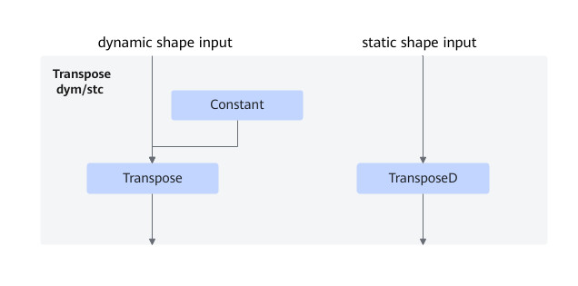

- The Einsum expression is in the form of "abcd, aebd->aebc":

    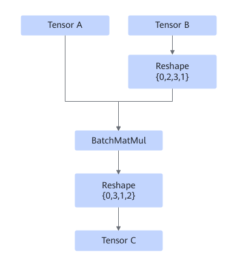

    Based on whether the input shape is dynamic, the **Reshape** node contains the operators shown in the following figure.

    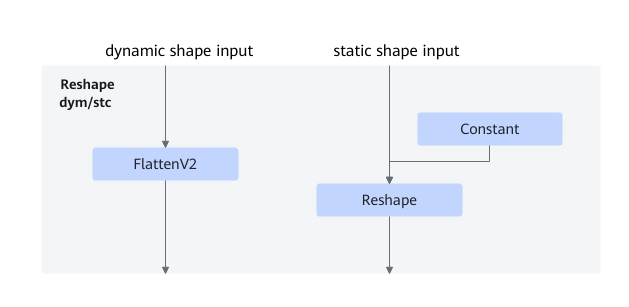

- The Einsum expression is in the form of "abcd, abce->acde":

    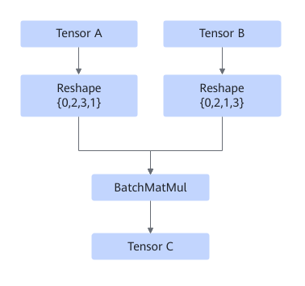

    Based on whether the input shape is dynamic, the **Reshape** node contains the operators shown in the following figure.

    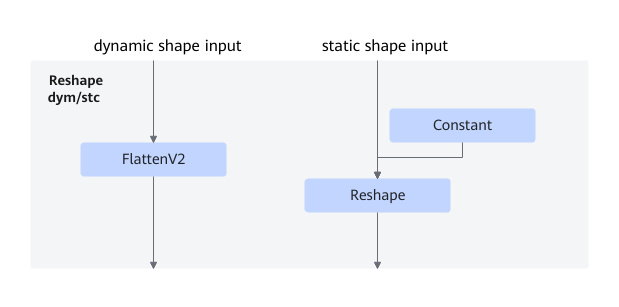

- The Einsum expression is in the form of "abc, abd->acd":

    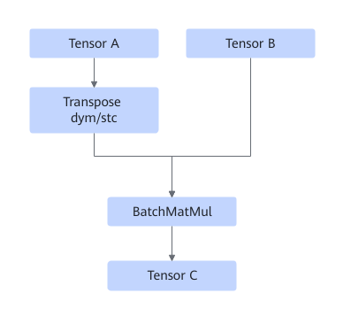

    Based on whether the input shape is dynamic, the **Transpose dym/stc** node contains the operators shown in the following figure.

    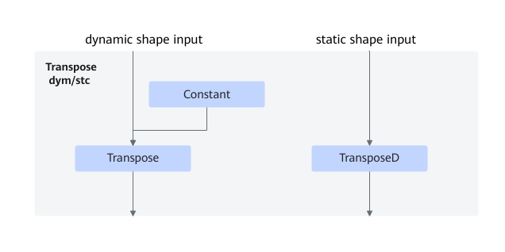

- The Einsum expression is in the form of "ab, cb->ac":

    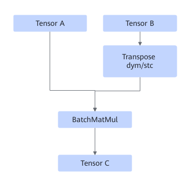

    Based on whether the input shape is dynamic, the **Transpose dym/stc** node contains the operators shown in the following figure.

    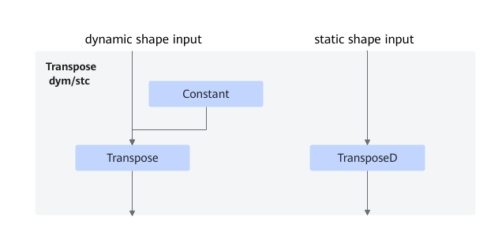

- The Einsum expression is in the form of "abc, acd->abd":

    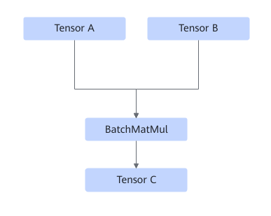

- The Einsum expression is in the form of "abc, adc->abd":

    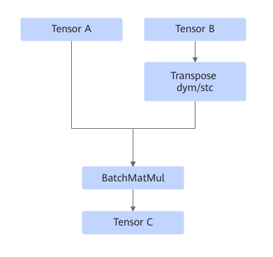

    Based on whether the input shape is dynamic, the **Transpose dym/stc** node contains the operators shown in the following figure.

    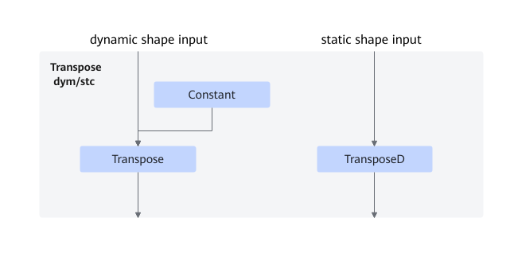

- The Einsum expression is in the form of "abcd, ced->abce":

    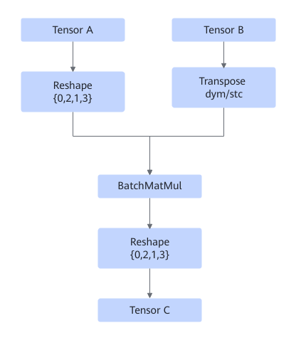

    Based on whether the input shape is dynamic, the **Reshape** node contains the operators shown in the following figure.

    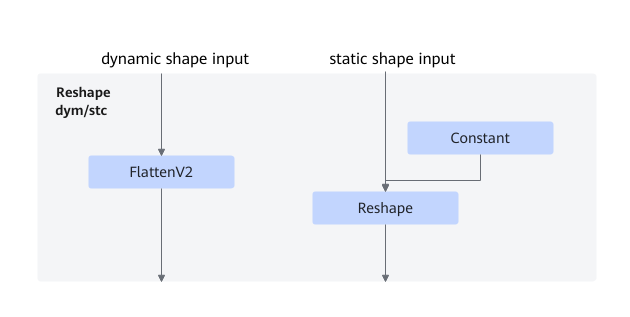

    Based on whether the input shape is dynamic, the **Transpose dym/stc** node contains the operators shown in the following figure.

    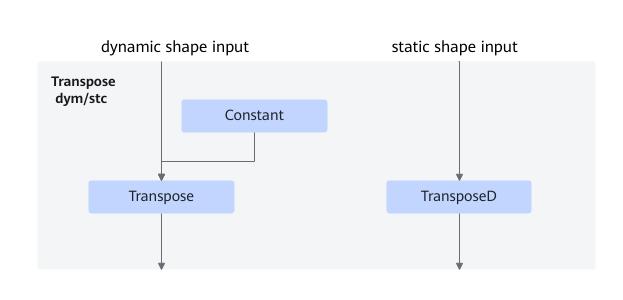

- The Einsum expression is in the form of "abcd, ebcd->bcae":

    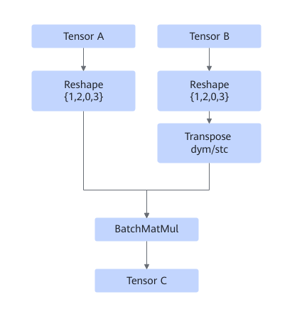

    Based on whether the input shape is dynamic, the **Reshape** node contains the operators shown in the following figure.

    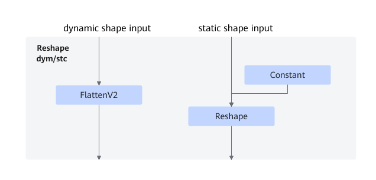

    Based on whether the input shape is dynamic, the **Transpose dym/stc** node contains the operators shown in the following figure.

    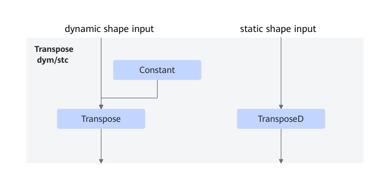

- The Einsum expression is in the form of "abcd, dabe->cabe":

    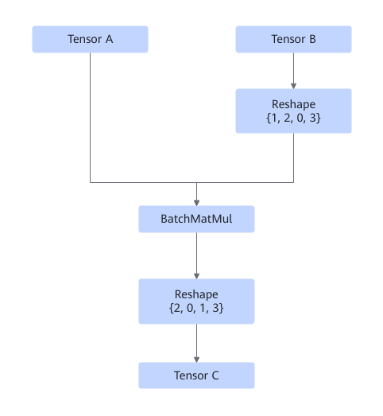

    Based on whether the input shape is dynamic, the **Reshape** node contains the operators shown in the following figure.

    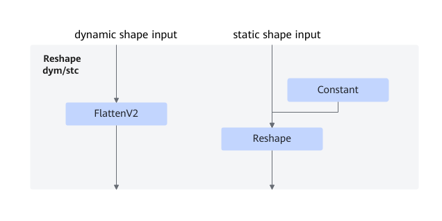

- The Einsum expression is in the form of "a, b->ab":

    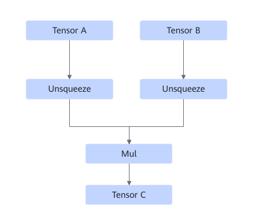

- The Einsum expression is in the form of "abcd, aecd->eb":

    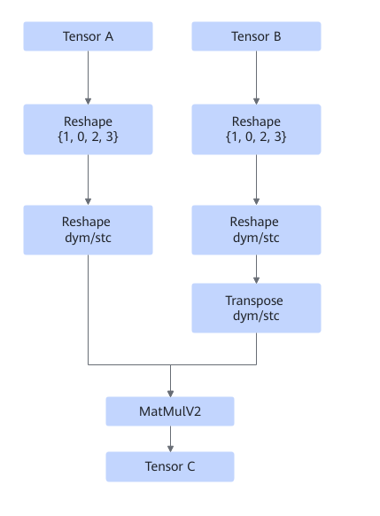

    Based on whether the input shape is dynamic, the **Reshape** node contains the operators shown in the following figure.

    

    Based on whether the input shape is dynamic, the **Transpose dym/stc** node contains the operators shown in the following figure.

    

- The Einsum expression is in the form of "abcd, eb->aecd":

  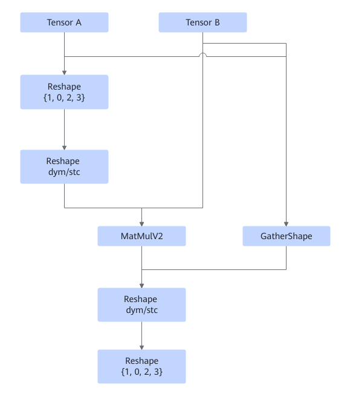

  Based on whether the input shape is dynamic, the **Reshape** node contains the operators shown in the following figure.

  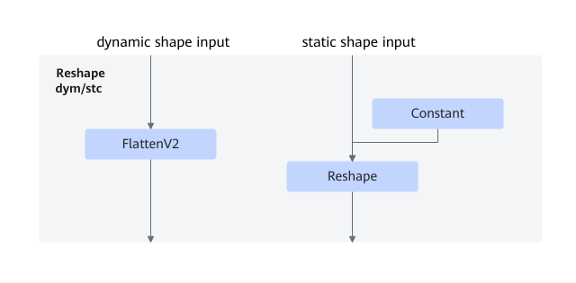

- For other dynamic shapes, there are two cases:
    1. Single-input:

        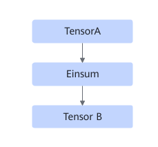

        After fusion

        

    2. Dual-input:
        1. Scenario 1

            

            After fusion

            

            Unsqueeze, ReduceSum, and Squeeze are optional operators, and each of them may appear multiple times.

        2. Scenario 2

            

            After fusion

            

            Unsqueeze, ReduceSum, Unsqueeze/FlattenV2, Reshape, Transpose, and Squeeze are optional, and ReduceSum and Unsqueeze/FlattenV2 may appear multiple times.

## Constraints

- This fusion pattern is enabled by default and cannot be disabled.
- The Einsum operator can have only one or two inputs, and the number of elements of the input tensor cannot overflow the int64 representation range.
- For static shapes, the Einsum expression supports only a single input with a single output or dual inputs with a single output.
- For static shapes, the input or output expression cannot have duplicate dimension labels.
- For static shapes, if the fused operator is BatchMatMul, the data type of the input tensor can only be float16 or float32.
- For dynamic shapes, only 14 Einsum expressions are supported (the specific dimension label is only an example): "abc,cde->abde", "abcd,aecd->aceb", "abcd,adbe->acbe", "abcd,cde->abe", "abc,cd->abd", "abc,dc->abd", "abc,abd->dc", "abc,dec->abde", "abc,abde->dec", "abcd,aecd->acbe", "abcd,acbe->aecd", "abcd,ecd->abe", "abcd,abe->ecd", and "abcd,acbe->adbe". If the Einsum operator has only one input, the input cannot have a dynamic shape.
- For dynamic shapes, the number of input dimensions must be the same as that in the corresponding Einsum input expression.
- For dynamic shapes, the Einsum expression supports a single input with a single output, dual inputs with a single output, or empty output. The input or output expression cannot have duplicate dimension labels. A dimension label of the output must exist in the input.
- For dynamic shapes, only input tensors with a maximum of four dimensions are supported.

## Applicable Products

<!-- npu="910b" id1 -->
Atlas A2 training products/Atlas A2 inference products
<!-- end id1 -->

<!-- npu="950" id2 -->
950PR/950DT
<!-- end id2 -->
