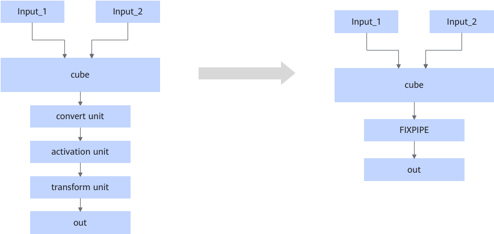

# FIXPIPEFUSIONPASS

## Description

On hardware with FixPipe support, when a cube operator has `support_fixpipe_ability` configured in [FixPipeAbilityProcessPass](FixPipeAbilityProcessPass.md), it will sequentially attempt to match the convert, activation, and transform units as shown in the figure below. If at least one of these units exists (nonexistent units are skipped), the matched operators will be fused into a FixPipe operator.

- convert unit: format conversion unit, which is typically a quant or cast operator.
- activation unit: activation unit, which is typically a ReLU operator.
- transform unit: format conversion unit for converting ND to NZ, which is typically a TransData operator.

## Constraints

- Only static networks are supported.
- This fusion pattern cannot be disabled.

## Applicable Products

<!-- npu="910b" id1 -->
Atlas A2 training products/Atlas A2 inference products
<!-- end id1 -->
