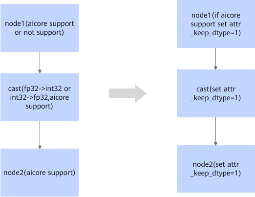

# ForceFp16CastFusionPass 

## Description

For cast operators, when converting input and output data types between int32 and fp32 (either int32->fp32 or fp32->int32), set `attr_keep_dtype` to improve the precision.

## Constraints

For cast operators, this fusion pattern is enabled when data types for the input and output are converted between int32 and fp32 (either int32->fp32 or fp32->int32).

## Applicable Products

<!-- npu="910b" id1 -->
Atlas A2 training products/Atlas A2 inference products
<!-- end id1 -->
