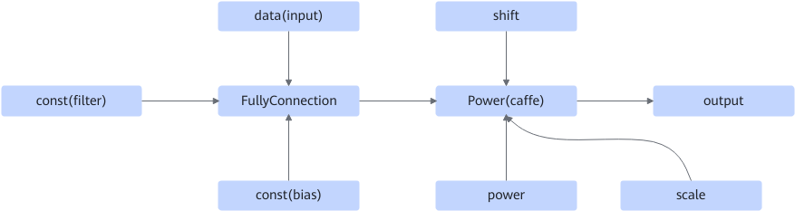

# FullyConnectionPowerPass

## Description

Fuses the FullyConnection+Power operators into the FullyConnectionPower operator.

After:

## Constraints

- The number of FC weights cannot be less than 2.
- The input data type of FC cannot be int8 or uint8.
