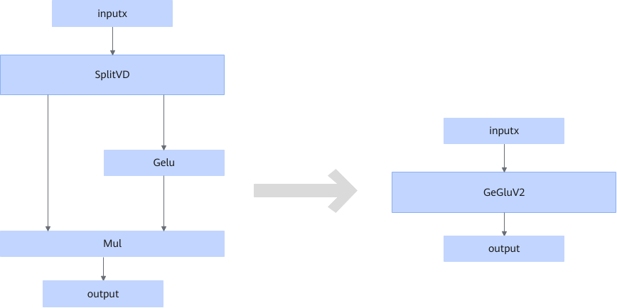

# GeGluV2FusionPass

## Description

Fuses small operators (SplitVD + Gelu + Mul) into the large operator GeGluV2.

## Constraints

Only the scenario where the split axis of the SplitVD node is greater than 512 is supported.

## Applicable Products

<!-- npu="310p" id1 -->
Atlas inference products
<!-- end id1 -->

<!-- npu="910b" id3 -->
Ascend_xxx_B in Atlas A2 training products/Atlas A2 inference products
<!-- end id3 -->

<!-- npu="A3" id2 -->
Atlas A3 training products/Atlas A3 inference products
<!-- end id2 -->
