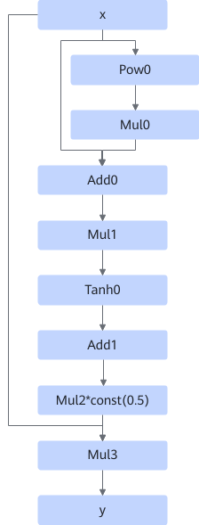
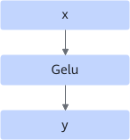
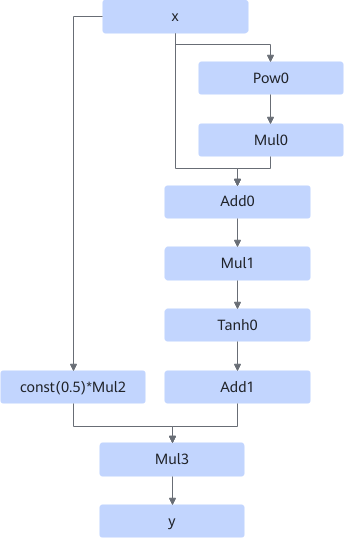
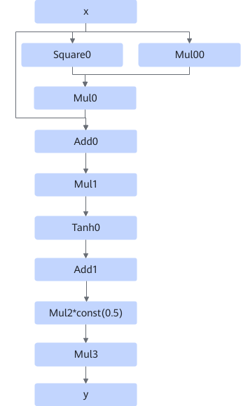
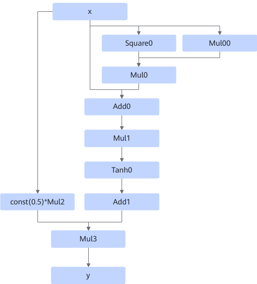
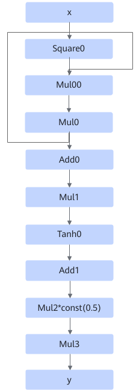
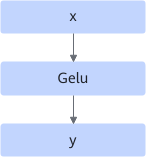
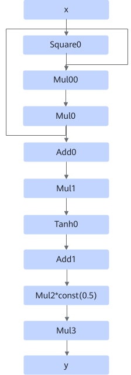
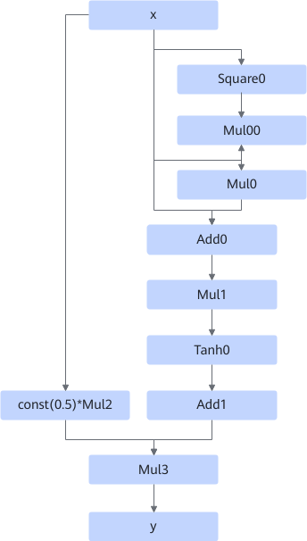

# GeluFusionPass

## Description

Fuses small operators, such as Pow, Mul, Add, and Tanh, into the Gelu operator.

The formula is as follows:

- Scenario 1:

    
    
    After:
    
    

- Scenario 2:

    
    
    After:
    
    

- Scenario 3:

    
    
    After:
    
    

- Scenario 4:

    
    
    After:
    
    

- Scenario 5:

    
    
    After:
    
    

- Scenario 6:

    
    
    After:
    
    

- Scenario 7:

 
 
 After:
 
 

- Scenario 8:

After:

## Constraints

- Dynamic shapes are not supported.
<!-- npu="910b" id2 -->
- Data type constraints:
  - Atlas A2 training products/Atlas A2 inference products: The data type can be FLOAT32, FLOAT16, or BFLOAT16.
<!-- end id2 -->

## Applicable Products

<!-- npu="910b" id1 -->
Atlas A2 training products/Atlas A2 inference products
<!-- end id1 -->
