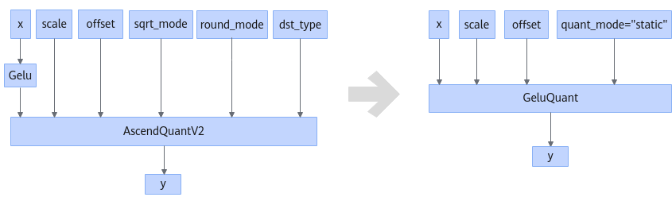
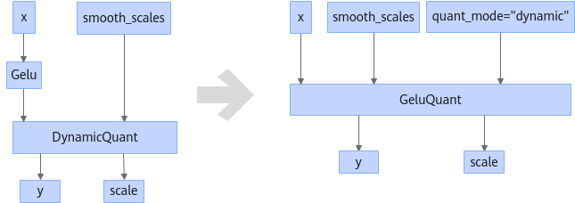

# GeluQuantFusionPass

## Description

Fuses the small operators (Gelu + AscendQuantV2) or (Gelu + DynamicQuant) into the large operator GeluQuant.

or

## Constraints

- The shape of the Gelu input parameter must be greater than or equal to two dimensions.
- The Gelu output connects to only one node AscendQuantV2 or DynamicQuant.
- The type of output `y` of the AscendQuantV2 or DynamicQuant operator is int8.
- When Gelu and the downstream AscendQuantV2 operator are fused, set `sqrt_mode` of AscendQuantV2 to `false`, `round_mode` of AscendQuantV2 to `round`, and `dst_type` of AscendQuantV2 to `int8`.

## Applicable Products

<!-- npu="910b" id1 -->
Atlas A2 training products/Atlas A2 inference products
<!-- end id1 -->
