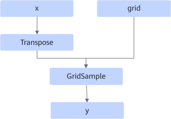
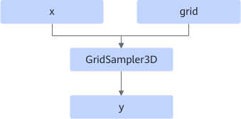
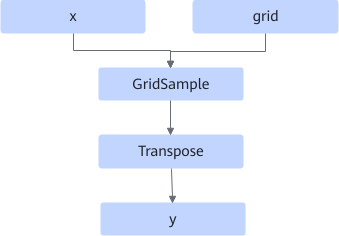

# GridSampler3DFusionPass

## Description

Replaces the GridSampler3D operator with the GridSample operator.

- Scenario 1: The input data format is NCDHW or ND.

  Before:  After: 

- Scenario 2: The input data format is NDHWC.

  Before:  After: 

## Constraints

- Dynamic shapes are not supported.
- The x and y data formats must be NCDHW, NDHWC, or ND and must be the same, and the shape must be 5D.
- The shape of grid must be 5D and the last dimension must be 3.
<!-- npu="910b" id2 -->
- Data type constraints:
  - Atlas A2 training products/Atlas A2 inference products: The data type can be FLOAT32 or FLOAT16.
  <!-- end id2 -->

## Applicable Products

<!-- npu="910b" id1 -->
Atlas A2 training products/Atlas A2 inference products
<!-- end id1 -->
