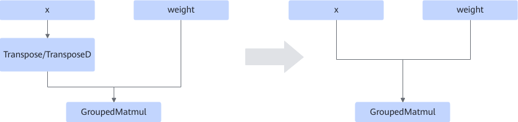
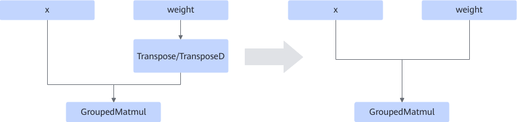
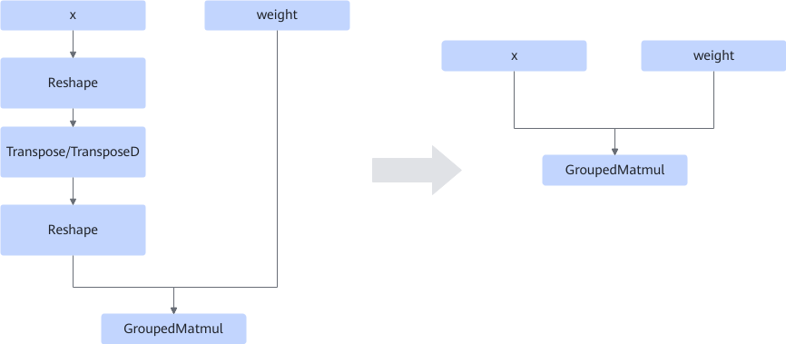
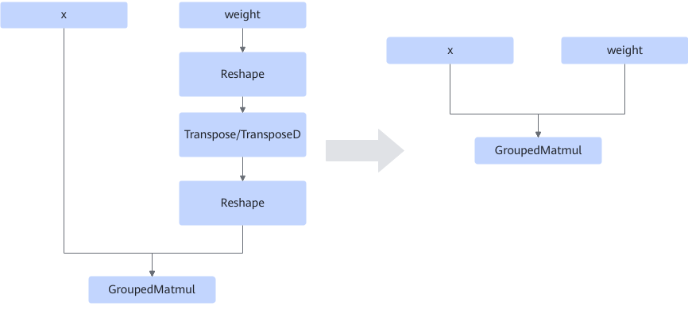
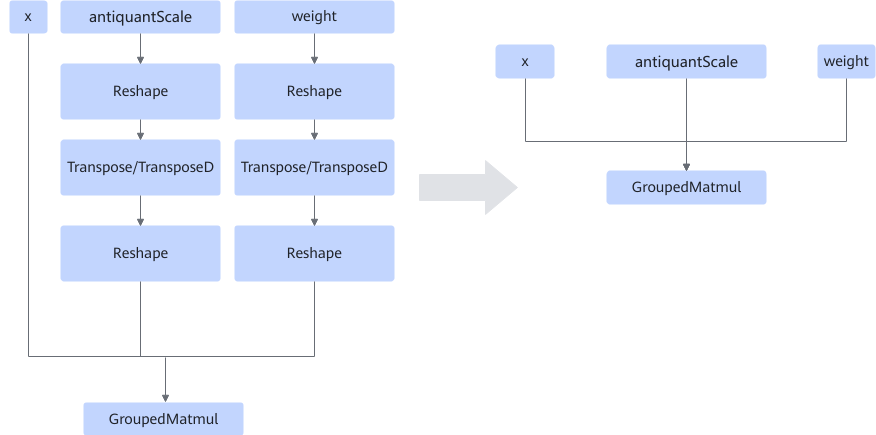
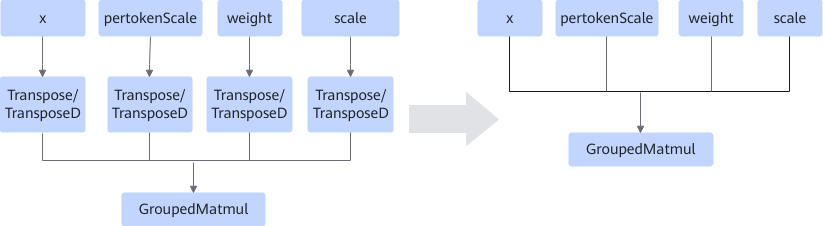

# GroupedMatmulTransFusionPass

## Description

Pattern 1: Deletes Transpose or TransposeD from the graph and encodes the x/weight transformation information to operator attributes. See the following figure.

<!-- npu="950,A3,910b" id2 -->
Pattern 2: Deletes Reshape, Transpose/TransposeD, and Reshape connected to the x/weight from the graph and encodes the weight transformation information to operator attributes. See the following figure.

This fusion pattern supports the following products:

<!-- npu="910b" id3 -->
Atlas A2 training products/Atlas A2 inference products
<!-- end id3 -->

<!-- npu="A3" id4 -->
Atlas A3 training products/Atlas A3 inference products
<!-- end id4 -->

<!-- npu="950" id5 -->
950PR/950DT
<!-- end id5 -->

<!-- end id2 -->
<!-- npu="950" id1 -->
Pattern 3: For 950PR/950DT in fake-quantization use cases, deletes Reshape+Transpose/TransposeD+Reshape connected to weight and antiquantScale from the graph and encodes the weight transformation information to operator attributes. See the following figure.

Pattern 4: For 950PR/950DT in MX/GB quantization use cases, deletes Transpose or TransposeD from the graph and encodes the x and weight transformation information to operator attributes. See the table below.

>[!NOTE]
>For 950PR/950DT in MX/GB quantization use cases, scale follows the weight transposition information, and pertokenScale follows the x transposition information.
<!-- end id1 -->

## Constraints

- Only the use case when x, weight, and y are single tensors is supported (a single tensor indicates that there is only one tensor in the tensorList input).
- Transpose/TransposeD supports transpose on the second and third axes.
