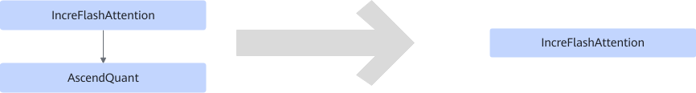

# IncreFlashAttentionQuantFusionPass

## Description

Fuses IncreFlashAttention+AscendQuant into the IncreFlashAttention operator in the quantization scenario. The `scale` and `offset` parameters of `quant` are converted into the input parameters `quant_scale2` and `quant_offset2` of `ifa`.

## Constraints

- The output of IncreFlashAttention must be fp16.
- The input of AscendQuant must be fp16, and the output must be int8.
- `quant_scale2` and `quant_offset2` of the IncreFlashAttention operator must be empty.
- The IncreFlashAttention operator can have only one output.

## Applicable Products

<!-- npu="910b" id1 -->
Atlas A2 training products/Atlas A2 inference products
<!-- end id1 -->

<!-- npu="A3" id2 -->
Atlas A3 training products/Atlas A3 inference products
<!-- end id2 -->
