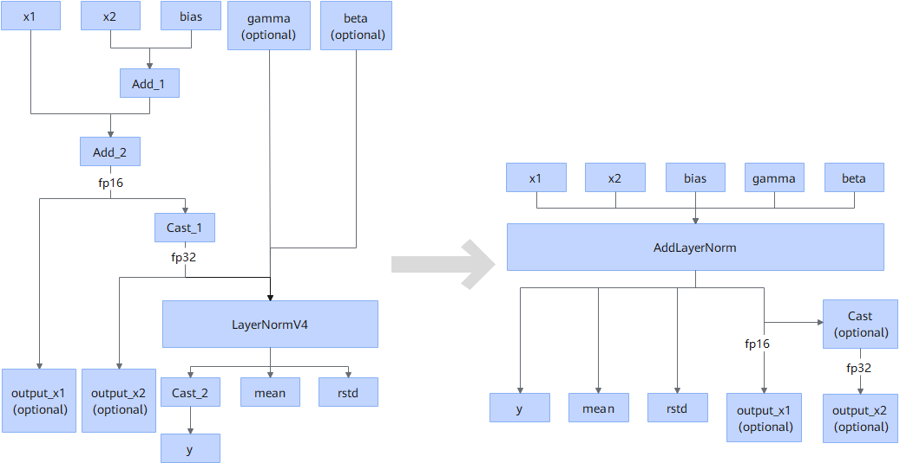

# IndexByTensorStaticFusionPass

## Description

Converts the IndexByTensor operator into the Index operator during static shape in PyTorch graph mode, to ensure that the graph sink is not damaged.

## Constraints

Only static shapes are supported.

## Applicable Products

<!-- npu="910b" id1 -->
Atlas A2 training products/Atlas A2 inference products
<!-- end id1 -->

<!-- npu="A3" id2 -->
Atlas A3 training products/Atlas A3 inference products
<!-- end id2 -->

<!-- npu="950" id3 -->
950PR/950DT
<!-- end id3 -->
