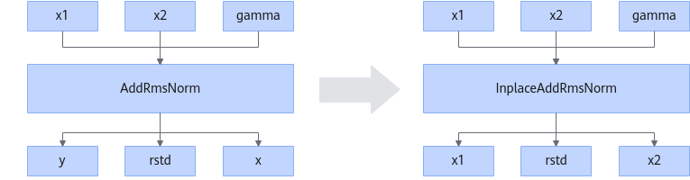
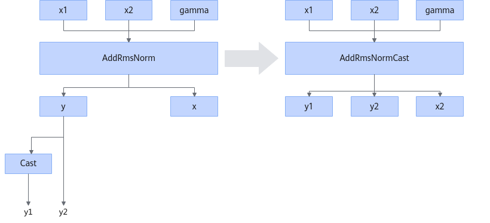

# InplaceAddRmsNormFusionPass

## Description

Scenario 1: Converts AddRmsNorm to InplaceAddRmsNorm by reusing the x1 input address as the y output address and the x2 input address as the x output address.

Scenario 2: Fuses AddRmsNorm and Cast into the AddRmsNormCast operator if the output y of AddRmsNorm is connected to only two outputs and the first output is connected to the Cast operator (to cast the output y from float16/bfloat16 to float32).

## Constraints

- This fusion pattern applies only to inference tasks.
- For the fusion into AddRmsNormCast:
  - The input x1 can only be of the float16 or bfloat16 type.
  - Only casting from float16 or bfloat16 to float32 is supported.
  - The output must not contain rstd either before or after fusion.

- For the fusion into InplaceAddRmsNorm: In non-950PR/950DT use cases, the second output of AddRmsNorm must not have any subsequent nodes.

## Applicable Products

<!-- npu="910b" id1 -->
Atlas A2 training products/Atlas A2 inference products
<!-- end id1 -->

<!-- npu="A3" id2 -->
Atlas A3 training products/Atlas A3 inference products
<!-- end id2 -->

<!-- npu="310p" id3 -->
Atlas inference products
<!-- end id3 -->

<!-- npu="950" id4 -->
950PR/950DT
<!-- end id4 -->
