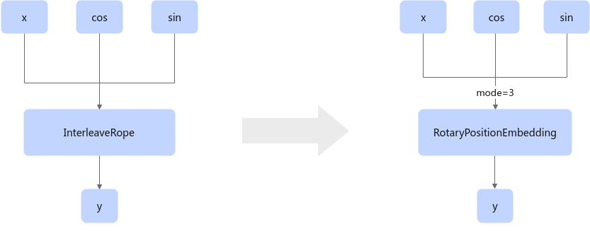

# InterleaveRope2RotaryPositionEmbeddingFusionPass

## Description

Fuses the InterleaveRope operator into the RotaryPositionEmbedding operator, as shown in the following fusion.

## Constraints

You are advised not to disable this pattern. Otherwise, the InterleaveRope Ascend IR function will be unavailable.

## Applicable Products

<!-- npu="950" id1 -->
950PR/950DT
<!-- end id1 -->
