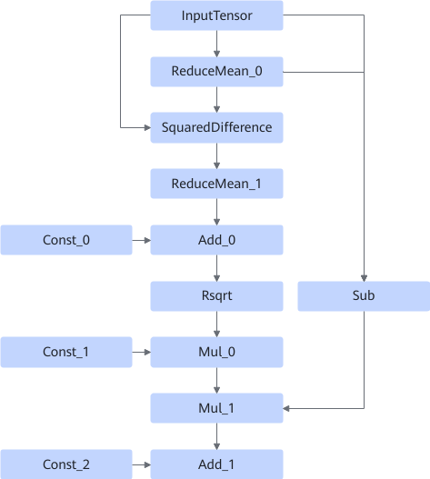
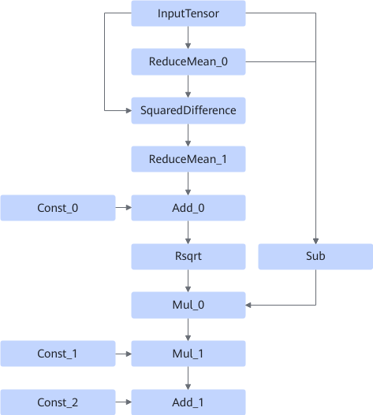
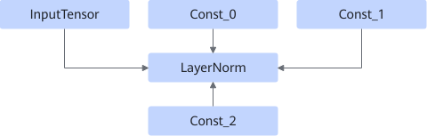

# LayerNormFusionPass

## Description

Identifies and fuses small operators such as ReduceMean and SquaredDifference into the LayerNorm operator.

- Scenario 1:

  

  After:

  

- Scenario 2:

  

  After:

  

## Constraints

- Dynamic shapes are not supported.
- Constraints on four input parameters:
  - InputTensor: The data format is ND, NCHW, or NHWC. The shape dimension must be greater than or equal to 1, and the value of the last dimension of the shape cannot be 1.
  - Const_0: 1D. The length of the shape must be 1.
  - Const_1: 1D. The length of the shape is equal to the length of the last dimension of the InputTensor shape.
  - Const_2: 1D. The length of the shape is equal to the length of the last dimension of the InputTensor shape.

- Input ReduceMean constraints:
  - The two ReduceMean operators must have the same `axes`, and `axes` must be the same as the last dimension of InputTensor.
  - `keep_dims` of the two ReduceMean operators must be `true`.

- Input Sub constraints:
  - The first parameter must be InputTensor.
  - The second parameter is the result of `ReduceMean_0` and cannot be swapped.

- The data type can only be FLOAT32 or FLOAT16.

## Applicable Products

<!-- npu="910b" id1 -->
Atlas A2 training products/Atlas A2 inference products
<!-- end id1 -->
