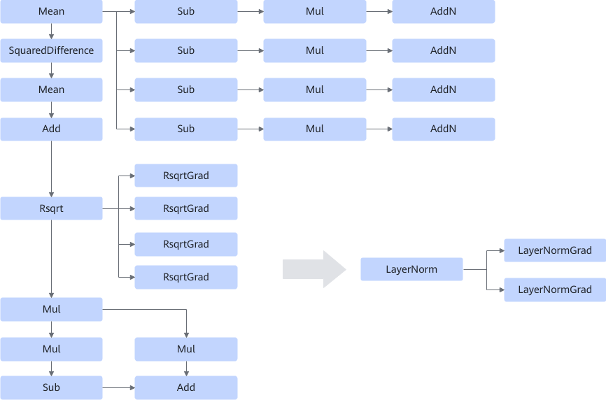

# LayerNormSpecialFourGradsTrainingFusionPass

## Description

Similar to LayerNormSpecialTrainingFusionPass, fuses the Mean/SquaredDifference/Add/Rsqrt/RsqrtGrad/Mul/Sub/AddN operator into one LayerNorm operator and two LayerNormGrad operators to improve the computing performance. The difference is that the fusion pass matches four backward patterns and fuses two backward LayerNorm structures whose scope names are the same as those of the forward LayerNorm into the LayerNormGrad operator. See the table below.

## Constraints

None
