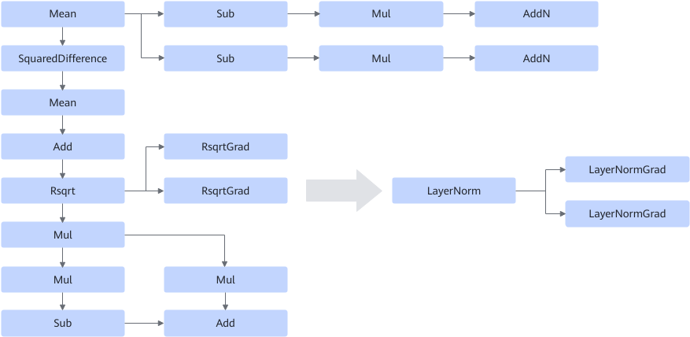

# LayerNormSpecialTrainingFusionPass

## Description

Fuses the Mean/SquaredDifference/Add/Rsqrt/RsqrtGrad/Mul/Sub/AddN operator into a LayerNorm operator and two LayerNormGrad operators to improve the computing performance. See the following figure.

## Constraints

None
