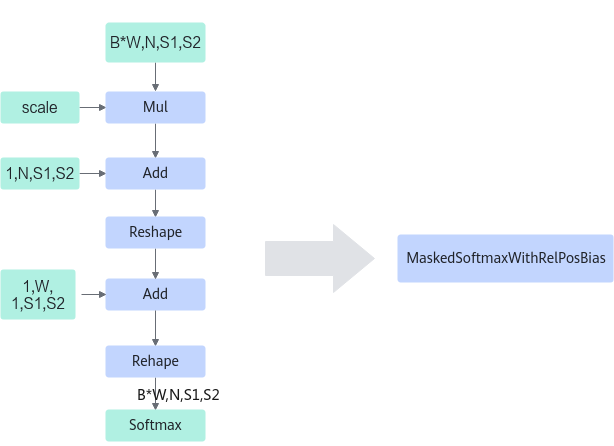
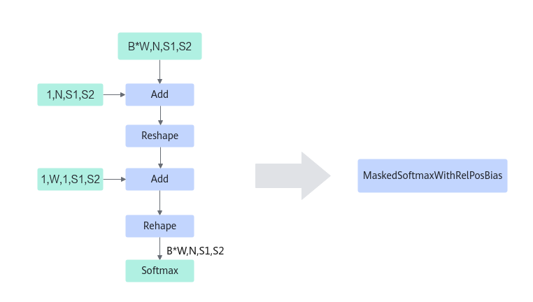
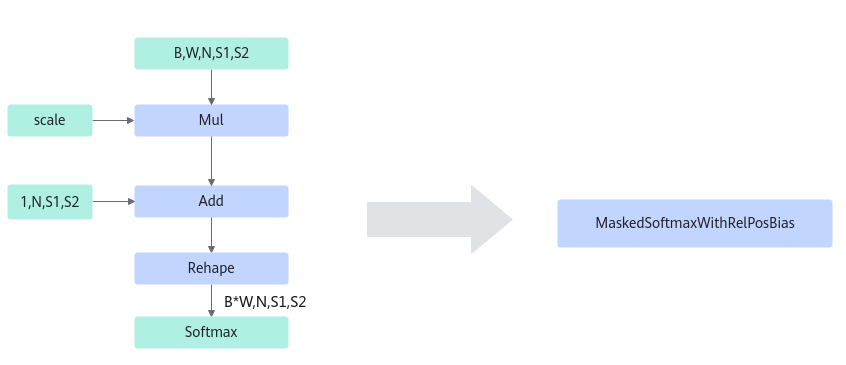
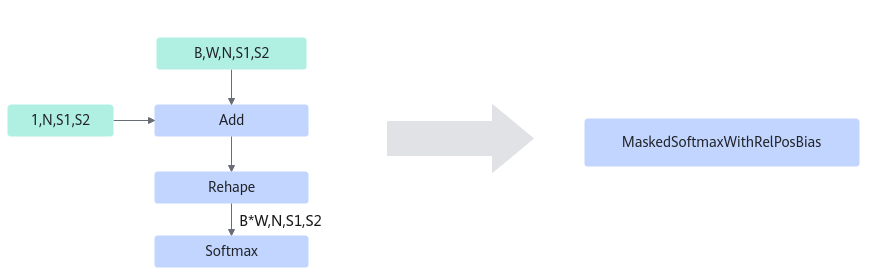

# MaskedSoftmaxWithRelPosBiasFusionPass 

## Description

Fuses Mul, Add, Reshape, and Softmax that meet the following conditions into the MaskedSoftmaxWithRelPosBias operator.

**Pattern 1**

**Pattern 2**

**Pattern 3**

**Pattern 4**

## Constraints

The input supports only four or five dimensions. Each fusion mode has the corresponding input shape, which is the base for constructing an operator. B, W, N, S1, and S2 indicate the dimensions of each shape, and `scale` indicates that the input is a scalar.

## Applicable Products

<!-- npu="310p" id1 -->
Atlas inference products
<!-- end id1 -->

<!-- npu="910b" id2 -->
Atlas A2 training products/Atlas A2 inference products
<!-- end id2 -->

<!-- npu="A3" id3 -->
Atlas A3 training products/Atlas A3 inference products
<!-- end id3 -->
