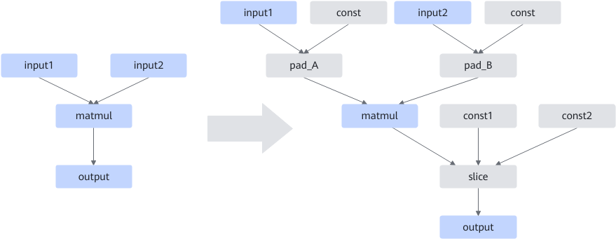

# MatMulAlignInputsFusionPass

## Description

When the inner axis of the input shape of the matmul operator is not 512-byte aligned, the MTE efficiency is low and the performance is poor. This graph fusion aligns the input shape of matmul to solve the performance problem.

## Constraints

Applies only to the static scenario where the input DType is Float32 and the input does not have bias.

This non-common fusion is performed only in certain cases.

## Applicable Products

<!-- npu="910b" id1 -->
Atlas A2 training products/Atlas A2 inference products
<!-- end id1 -->

<!-- npu="A3" id2 -->
Atlas A3 training products/Atlas A3 inference products
<!-- end id2 -->
