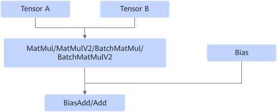
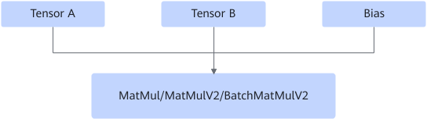

# MatMulBiasAddFusionPass

## Description

Fuses the MatMul/MatMulV2/MatMulV3/BatchMatmul/BatchMatMulV2 and biasadd/add operators into the MatMul/MatMulV2/MatMulV3/BatchMatmul/BatchMatMulV2 operator.

After:

## Constraints

- One of the two inputs of the add operator must have a dimension of 1.
- The value of bias must be the same as that of the last dimension of the MatMul or MatMulV2/BatchMatmul/BatchMatMulV2 output.
- The output dimension of MatMul/MatMulV2 is 2.
- broadcast is not supported. (broadcast enables two tensors with different shapes to automatically expand to the same shape for element-wise operations. broadcast checks the shapes of the two tensors from right to left. If the dimension of one side is 1, it automatically expands to be the same as that of the other side.)
- If BiasAdd/Add is computed in FP16 before fusion, bias is accumulated inside matmul in FP32 after fusion. This leads to a precision improvement. If you disable MatMulBiasAddFusionPass, the precision remains unchanged.

## Applicable Products

<!-- npu="910b" id1 -->
Atlas A2 training products/Atlas A2 inference products
<!-- end id1 -->

<!-- npu="A3" id2 -->
Atlas A3 training products/Atlas A3 inference products
<!-- end id2 -->

<!-- npu="950" id3 -->
950PR/950DT
<!-- end id3 -->
