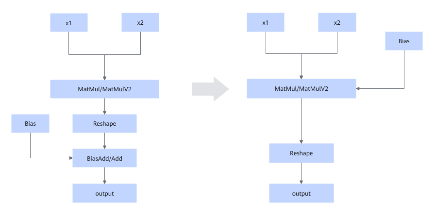

# MatMulReshapeBiasAddFusionPass  

## Description

Applies a Reshape operation to the output of the MatMul operator, followed by a BiasAdd/Add operation on the reshaped output.

## Constraints

- MatMul/MatMulV2 can have only two inputs.
- The input of BiasAdd/Add must be the outputs of Bias and Reshape.
- The Reshape node cannot split the tail axis of the MatMul output.
- The shape of BiasAdd/Add is the tail axis of the MatMul output.
- This fusion pattern takes effect only in the static graph mode.

## Applicable Products

<!-- npu="910b" id1 -->
Atlas A2 training products/Atlas A2 inference products
<!-- end id1 -->

<!-- npu="A3" id2 -->
Atlas A3 training products/Atlas A3 inference products
<!-- end id2 -->

<!-- npu="950" id3 -->
950PR/950DT
<!-- end id3 -->
