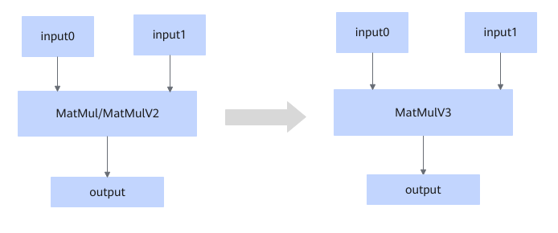

# MatMulToMatmulV3FusionPass

## Description

Converts the MatMulV2/MatMul operators that meet the fusion pattern into the MatMulV3 operator.

## Constraints

None

## Applicable Products

<!-- npu="950" id1 -->
950PR/950DT
<!-- end id1 -->
