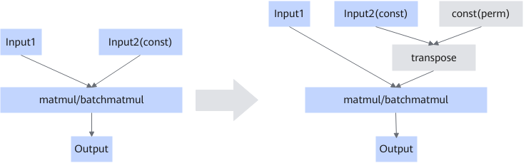

# MatMulTransposeWeightFusionPass

## Description

In a two-dimensional matrix, the first axis is defined as the outer axis and the second axis as the inner axis. For example, in A = M × K, the inner axis is K. After transposition, you get A^T = K × M, and the inner axis becomes M.

When the storage units of the inner axis in the input shape of the matmul/batchmatmul operator are not aligned to multiples of 512 bytes, the MTE efficiency is low and the performance is poor. This graph fusion transposes the inner and outer axes of the input shape of matmul to achieve axis alignment and solve the performance problem.

## Applicable Products

<!-- npu="910b" id1 -->
Atlas A2 training products/Atlas A2 inference products
<!-- end id1 -->
