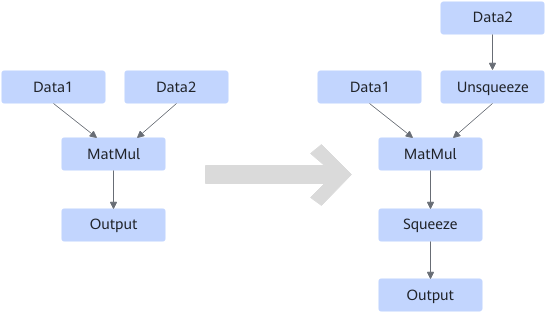
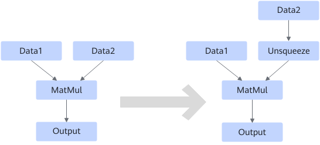
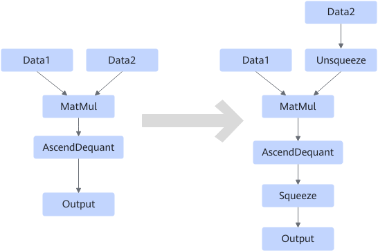

# MatMulUnsqueezeSqueezeFusionPass

## Description

**Fusion pattern 1**

If the MatMul, MatMulV2, BatchMatmul, and BatchMatmulV2 operators support 1 dim x N dim and N dim x 1 dim input, insert an Unsqueeze operator to convert the 1-D input into a 2-D input. After the MatMul operation, insert the Squeeze operator to remove the added dimension from the output.

**Fusion pattern 2**

If the MatMul, MatMulV2, BatchMatmul, and BatchMatmulV2 operators support 1 dim x 1 dim input, insert an Unsqueeze operator to convert the 1-D input into a 2-D input.

**Fusion pattern 3**

MatMul/MatMulV2/BatchMatmul/BatchMatmulV2 supports AscendDequant.

## Constraints

None
