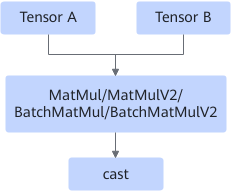
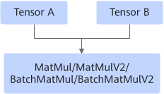

# MatmulCastFusionPass

## Description

Fuses the MatMul/MatMulV2/BatchMatMul/BatchMatMulV2 and cast operators into the MatMul/MatMulV2/BatchMatMul/BatchMatMulV2 operator.

After:

## Constraints

This fusion takes effect when the input data type of MatMul is float16 and the output data type of cast is float32.

## Applicable Products

<!-- npu="310p" id1 -->
Atlas inference products
<!-- end id1 -->

<!-- npu="910" id2 -->
Atlas training products
<!-- end id2 -->
