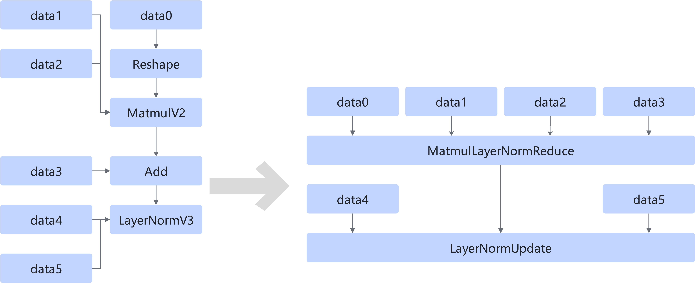
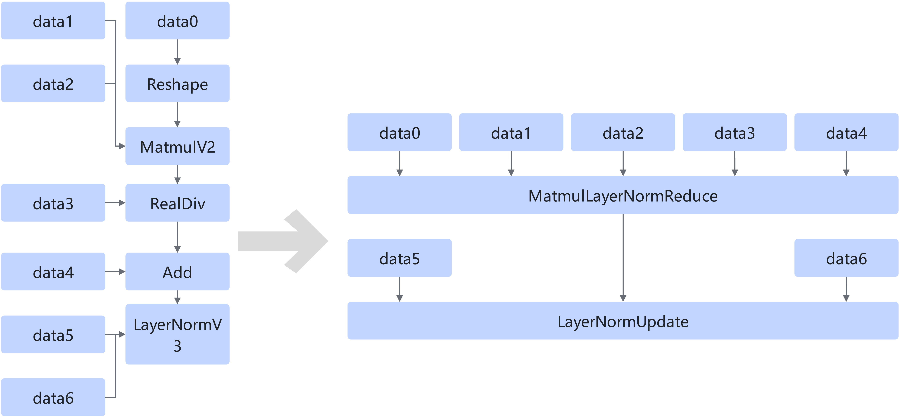

# MatmulLayerNormReduceFusionPass

## Description

Fuses the structure that meets the following patterns into the MatmulLayerNormReduce+LayerNormUpdate operator.

Or

## Constraints

It takes effect only on the SDXL network.

## Applicable Products

<!-- npu="310p" id1 -->
Atlas inference products
<!-- end id1 -->
