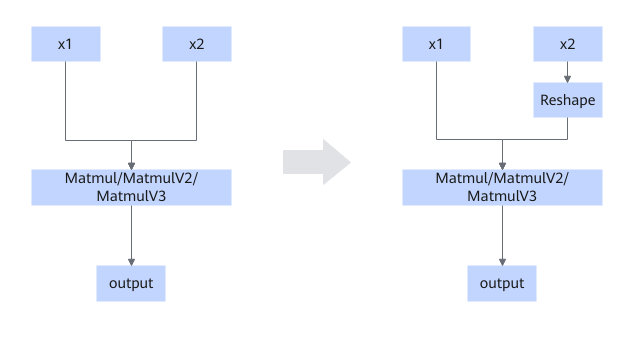

# MatmulReshapeFusionPass

## Description

Adds a Reshape node to the second input when the N axis of Matmul equals 1.

## Constraints

- This pattern is disabled by default. You can enable it by referring to [How to Disable or Enable a Fusion Pattern](../Introduction.md).
- Only static shapes are supported.
- Supported data types: BFLOAT16, FLOAT16, and FLOAT32.
- The input of x1 is [M, K]. The input of x2 is not transposed, and since `N=1` is on the last axis, the x2 input is [K, 1].
- The fusion pattern takes effect when the data type is BFLOAT16 or FLOAT16, and K is less than 27392.
- This fusion pattern does not take effect when the data type is BFLOAT16 or FLOAT16, 8 ≤ K ≤ 64, and M ≥ 8192.
- This fusion pattern does not take effect when the data type is BFLOAT16 or FLOAT16, K is greater than 12800, and M is greater than 16384.
- The fusion pattern does not take effect when the data type is FLOAT32, 8 ≤ K ≤ 64, and 8192 ≤ M ≤ 32768.
- This fusion pattern does not take effect when the data type is FLOAT32, M = 9, or K = 23697 or 27167.

## Applicable Products

<!-- npu="910b" id1 -->
Atlas A2 training products/Atlas A2 inference products
<!-- end id1 -->

<!-- npu="A3" id2 -->
Atlas A3 training products/Atlas A3 inference products
<!-- end id2 -->

<!-- npu="950" id3 -->
950PR/950DT
<!-- end id3 -->
