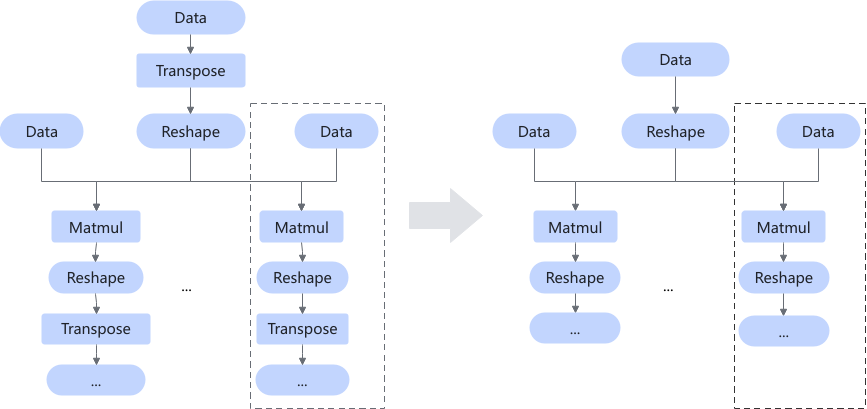

# MatmulReshapeTransposeFusionPass

## Description

Deletes the Transpose operators before and after the Matmul operator that complies with the graph fusion pattern, and exchanges the two inputs of the Matmul operator.

There may be one or more structures in the dashed-line box.

## Constraints

- The operator dtype can only be FP32.
- The format can only be ND, NCHW, or NHWC.
- The input of the left matrix of the Matmul operator must be 2D, and the input of the right matrix must be 3D. The shape of the last dimension of the right matrix must be 1.
- The input of all Transpose operators must be 3D, and the shape of the last dimension must be 1. That is, the first two dimensions of the shape are exchanged and dynamic shape are not supported.
- The Reshape operator before the Matmul operator deletes the last dimension of 1 in the shape. The Reshape operator after the Matmul operator adds a dimension of 1 to the end of the shape.
- `transpose_x1`/`transpose_x2` of the Matmul operator must be `false`.
- There is at least one Matmul+Reshape+Transpose structure after the first Reshape operator. Multi-channel Matmul+Reshape+Transpose is supported. The structure of each channel must meet the preceding conditions. Otherwise, fusion is not supported.

## Applicable Products

<!-- npu="310b" id1 -->
Atlas 200I/500 A2 inference products
<!-- end id1 -->

<!-- npu="910b" id2 -->
Atlas A2 training products/Atlas A2 inference products
<!-- end id2 -->

<!-- npu="A3" id3 -->
Atlas A3 training products/Atlas A3 inference products
<!-- end id3 -->

<!-- npu="950" id4 -->
950PR/950DT
<!-- end id4 -->
