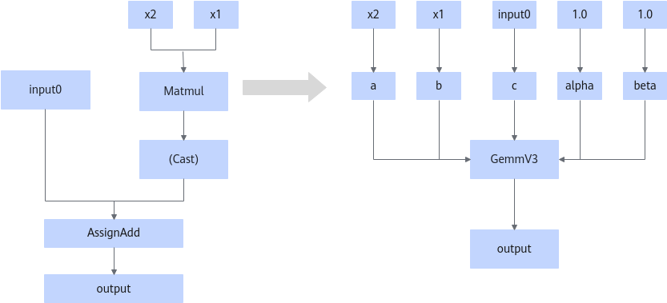

# MatmulToGemmOpFusionPass

## Description

Converts the MatMulV3/MatMulV2/MatMul operators that meet the fusion pattern into the GemmV3 operator.

## Constraints

- The Cast node between the MatMul and AssignAdd nodes may not exist. Matching without the Cast node is supported.
- The MatMul type includes MatMul, MatMulV2, and MatMulV3.
- The input dtype of the MatMul node can only be float16, float32, or bfloat16.
- The input dtype of the AssignAdd node can only be float32.
- Disabling this functionality may impact the network accuracy. We recommend not disabling it.

## Applicable Products

<!-- npu="950" id1 -->
950PR/950DT
<!-- end id1 -->
