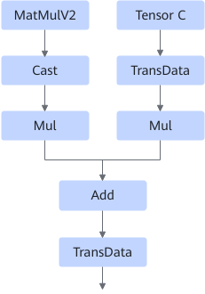
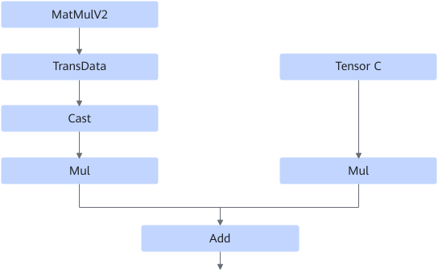
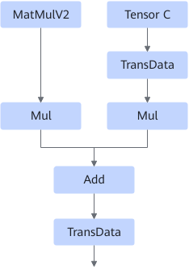
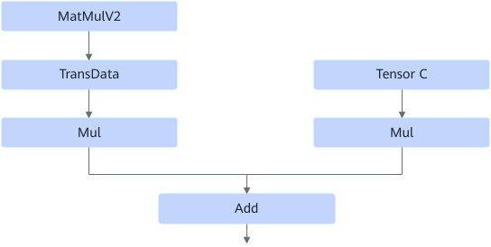

# MatmulTransdataFusionPass

## Description

Reduces the number of Transdata operators in the graph from 2 to 1 through equivalent replacement.

After:

When the Cast operator is absent:

After:

## Constraints

None
