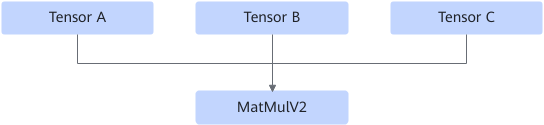
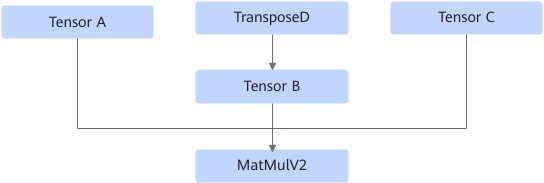

# Matmulv2FusionPass

## Description

For the MatMulV2 operator with three inputs in the weight int8 quantization scenario, inserts the TransposeD operator before the input TensorB to be transposed.

After:

## Constraints

- The OpDesc of MatMulV2 must have the `transpose_b` attribute set to `True`.
- The number of dimensions of Tensor B must be 2, and the data type must be int8.
- The source framework MatMul IR must have the `transpose_b` attribute.
