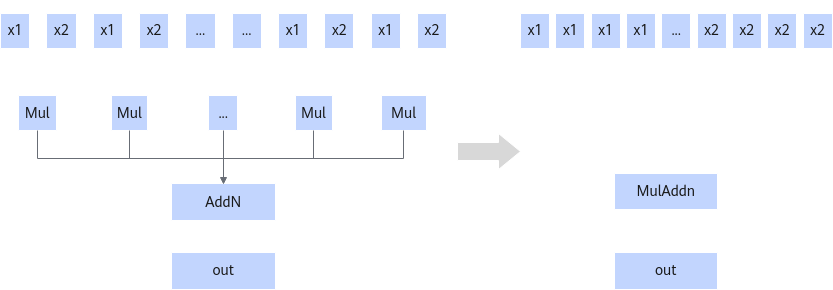
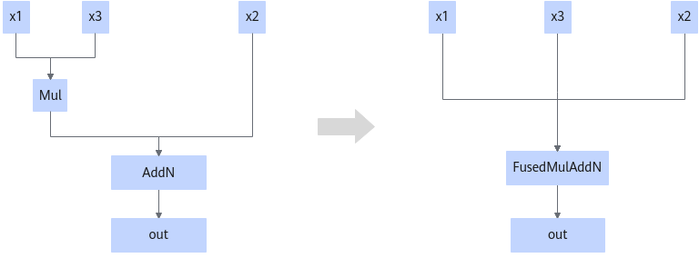

# MulAddNPass

## Description

Fuses multiple Mul nodes and the AddN node into one MulAddN node when the number of Mul nodes is greater than 2.

When the number of input nodes of AddN is 2, this fusion pattern fuses Mul and AddN into one FusedMulAddN node. One of the inputs of the Mul node must be a scalar or a tensor containing only one element.

## Constraints

- When the number of Mul nodes is greater than 2:
  - The inputs have a dynamic shape. The input shape of x1 is [B,M,1], and that of x2 is [B,1,N].
  - The maximum value of N in the shape of x2 is **2040**.

- When the number of input nodes of AddN is 2:
  - The input x3 must be either a scalar or a tensor containing only one element.
  - The Mul node must serve as the first input of the AddN node. Otherwise, fusion is not performed.

## Applicable Products

<!-- npu="910b" id1 -->
Atlas A2 training products
<!-- end id1 -->

<!-- npu="A3" id2 -->
Atlas A3 training products/Atlas A3 inference products
<!-- end id2 -->

<!-- npu="950" id3 -->
950PR/950DT
<!-- end id3 -->
