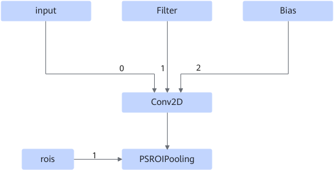
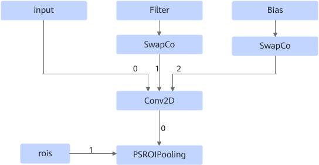
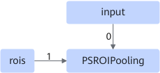
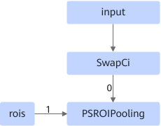

# PSROIPoolingFusionPass

## Description

If the input of PSROIPooling is Conv2D, inserts the SwapCo operator as the Filter and Bias output of Conv2D. If the input of PSROIPooling is not Conv2D, inserts the SwapCi operator as the input of PSROIPooling.

After:

Or

After:

## Constraints

The precursor node of PSROIPooling must be connected to input0, and the rois parameter of input1 must be specified.
