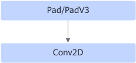

# PadConv2dFusionPass

## Description

Fuses the Pad/PadV3+Conv2D operators into the Conv2D operator.

After:

Forward fusion applies only to the Pad/PadV3+Conv2D graph scenario.

Backward fusion applies only in the backward process corresponding to the forward scenario in the training network. Pad+Conv2DBackpropFilterD is fused into a new Conv2DBackpropFilterD while Pad is eliminated. Conv2DBackpropInputD+Slice is fused into a new Conv2DBackpropInputD while Slice is eliminated.

## Constraints

- Dynamic shapes are not supported.
- The Pad/PadV3 operator cannot be connected to multiple Conv2D nodes. The first node of the structure before fusion is connected only to the next node. For example, the pad output is sent to only one Conv2D node.
- The value of `paddings` cannot be less than 0.
- The PadV3 operator supports fusion only when `mode` is `constant` and `constant_values` is `0` (dtype is fp32).
- The pad of the N/C dimension of the Pad/PadV3 operator can only be 0. The Pad/PadV3 operator supports padding only in the H or W dimension of Conv2D. After fusion, the padding size must be within the range of [0, 255], and the values of `pad_top` and `pad_bottom` must be less than `kernel_h`.

## Applicable Products

<!-- npu="310p" id1 -->
Atlas inference products
<!-- end id1 -->

<!-- npu="310b" id2 -->
Atlas 200I/500 A2 inference products
<!-- end id2 -->

<!-- npu="910" id3 -->
Atlas training products
<!-- end id3 -->

<!-- npu="910b" id4 -->
Atlas A2 training products/Atlas A2 inference products
<!-- end id4 -->

<!-- npu="A3" id5 -->
Atlas A3 training products/Atlas A3 inference products
<!-- end id5 -->

<!-- npu="950" id7 -->
950PR/950DT
<!-- end id7 -->
