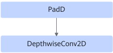

# PadDepthwiseConv2dFusionPass

## Description

Fuses the PADD+DepthwiseConv2D operators into the DepthwiseConv2D operator.

After:

## Constraints

- Dynamic shapes are not supported.
- The PadD operator cannot be connected to multiple DepthwiseConv2D structures.
- Before fusion, DepthwiseConv2D must have valid padding attributes.
- The PadD operator supports padding only in the H or W dimension of DepthwiseConv2D. After fusion, the padding size must be within the range of [0, 255], and the values of `pad_top` and `pad_bottom` must be less than `kernel_h`.

## Applicable Products

<!-- npu="310p" id1 -->
Atlas inference products
<!-- end id1 -->

<!-- npu="310b" id2 -->
Atlas 200I/500 A2 inference products
<!-- end id2 -->

<!-- npu="910" id3 -->
Atlas training products
<!-- end id3 -->

<!-- npu="910b" id4 -->
Atlas A2 training products/Atlas A2 inference products
<!-- end id4 -->

<!-- npu="A3" id5 -->
Atlas A3 training products/Atlas A3 inference products
<!-- end id5 -->

<!-- npu="950" id7 -->
950PR/950DT
<!-- end id7 -->
