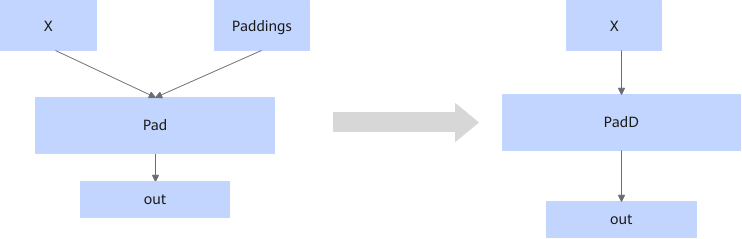

# PadFusionPass 

## Description

Fuses the Pad operator that fits the graph fusion pattern into the PadD operator when the input `paddings` is a const node, and converts the input into an attribute.

## Constraints

If the data type of input x is not within `{float16,float,int32}`, graph fusion is not performed.

## Applicable Products

<!-- npu="910b" id1 -->
Atlas A2 training products/Atlas A2 inference products
<!-- end id1 -->
