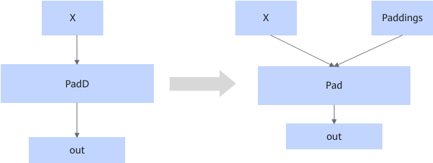

# PaddUpdateFusionPass 

## Description

Fuses the PadD operator that fits the graph fusion pattern into the Pad operator in static and non-5HD scenarios, and converts the attributes into inputs.

## Constraints

- The fusion pattern does not take effect in dynamic scenarios.
- The fusion pattern does not take effect when the input format is 5HD.
- The fusion pattern does not take effect when the input and output shapes are the same.
- The fusion pattern does not take effect when the input shape is in the blocklist `{1,3200,256}`.
- This fusion pattern is enabled by default in the single-operator mode and can be disabled.

## Applicable Products

<!-- npu="910b" id1 -->
Atlas A2 training products/Atlas A2 inference products
<!-- end id1 -->
