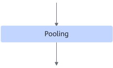
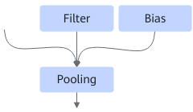

# PoolingFusionPass

## Description

After:

## Constraints

- Dynamic shapes are not supported.
- The static fusion data type can only be float16 or int8.
- The fusion pattern takes effect for AVG Pooling only. If the network of AVG Pooling has been int8 quantized, that is, the `pool` attribute is set to `AVG` in the prototxt file, the fusion pattern must be enabled.
