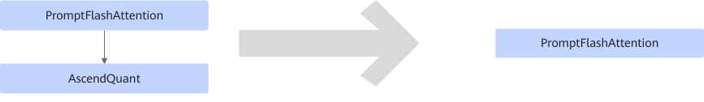

# PromptFlashAttentionQuantFusionPass

## Description

Fuses PromptFlashAttention+AscendQuant into the PromptFlashAttention operator in quantization use cases. The `scale` and `offset` parameters of `quant` are converted into the input parameters `quant_scale2` and `quant_offset2` of `pfa`.

## Constraints

- PromptFlashAttention supports only fp16 output.
- AscendQuant supports only fp16 input and int8 output.
- `quant_scale2` and `quant_offset2` of the PromptFlashAttention operator must be empty.
- The PromptFlashAttention operator can have only one output.

## Applicable Products

<!-- npu="910b" id1 -->
Atlas A2 training products/Atlas A2 inference products
<!-- end id1 -->

<!-- npu="A3" id2 -->
Atlas A3 training products/Atlas A3 inference products
<!-- end id2 -->
