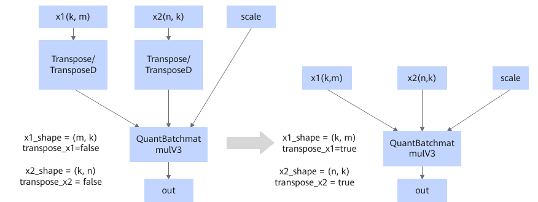

# QuantBatchMatmulV3TransposeFusionPass

## Description

Fuses the Transpose/TransposeD nodes connected to the inputs x1 and x2 of QuantBatchMatmulV3 and transfers their information into the `transpose_x1` and `transpose_x2` attributes of QuantBatchMatmulV3.

x1 and x2 are independent of each other. The fusion can be triggered as long as a Transpose node appears on either input path.

## Constraints

None

## Applicable Products

<!-- npu="910b" id1 -->
Atlas A2 training products/Atlas A2 inference products
<!-- end id1 -->

<!-- npu="A3" id2 -->
Atlas A3 training products/Atlas A3 inference products
<!-- end id2 -->

<!-- npu="950" id3 -->
950PR/950DT
<!-- end id3 -->
