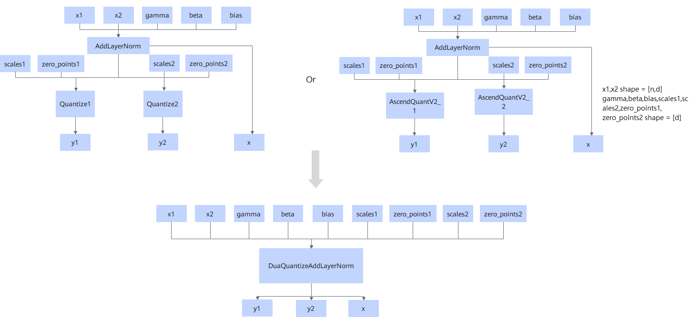
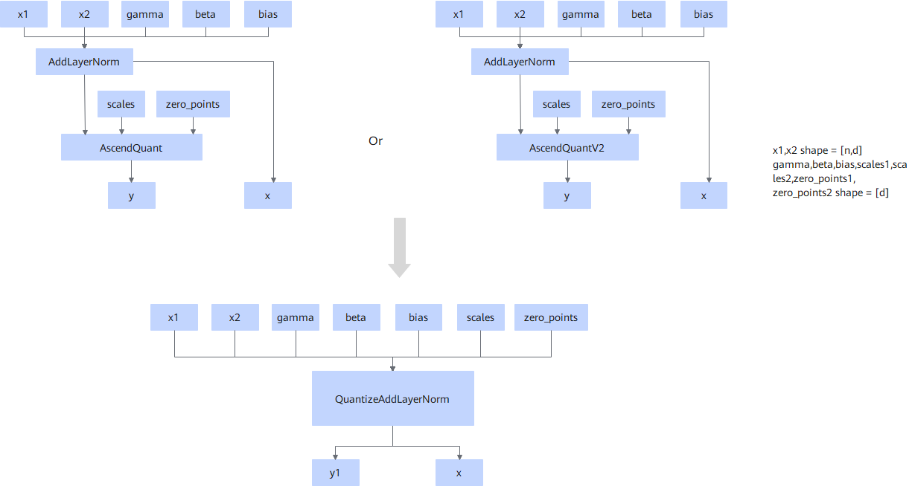
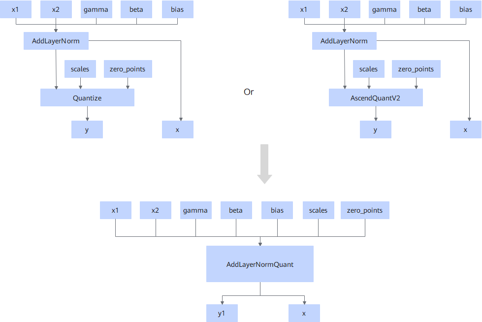
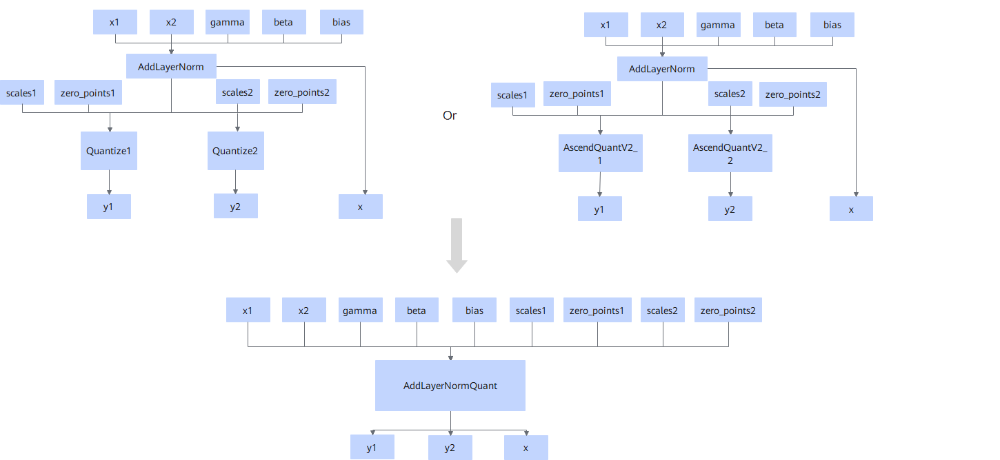

# QuantizeAddLayerNormPass

## Description

Scenario 1: Fuses the two Quantize operators or two AscendQuantV2 operators connected to the output y of AddLayerNorm into the DuaQuantizeAddLayerNorm operator.

Scenario 2: Fuses the AscendQuant or AscendQuantV2 operator connected to the output y of AddLayerNorm into the QuantizeAddLayerNorm operator.

Scenario 3: Fuses the AddLayerNorm operator and one or two Quantize or AscendQuantV2 operators connected to it into the AddLayerNormQuant operator on 950PR/950DT.

## Constraints

  <!-- npu="950" id5 -->
- For 950PR/950DT:
  - The quantization node must be Quantize or AscendQuantV2. Single- or dual-input quantization is supported. In dual-input quantization, the two quantization nodes must be of the same type. Only the int8 quantization type is supported.
  - The data type of the AddLayerNorm input parameter **x1** can be bf16, fp16, or fp32. The data types of other input parameters must be the same as that of **x1**. The AddLayerNorm output does not contain **mean** or **rstd**.
  - If the quantization node is Quantize, the data type of the input parameter **x** must be the same as that of the input parameter **x1** of AddLayerNorm. The data type of the input parameter **scale** must be fp32 or the same as that of the input parameter **x1** of AddLayerNorm.
  <!-- end id5 -->

  <!-- npu="A3,910b" id4 -->
- For Atlas A2 training products/Atlas A2 inference products and Atlas A3 training products/Atlas A3 inference products:
  - The number of input parameters of AddLayerNorm must be at least 5, and the parameter **bias** must exist.
  - For the fusion into DuaQuantizeAddLayerNorm, the AddLayerNorm node must be connected to two quantization nodes. The data type of the input parameter **x1** of AddLayerNorm must be bf16, and the tail axis must be 32-byte aligned.
  - For the fusion into QuantizeAddLayerNorm, the AddLayerNorm node must be connected to a single quantization node. When the quantization node is AscendQuant, the data type of the input parameter **x1** of AddLayerNorm cannot be fp32, and the tail axis must be 32-byte aligned.
  <!-- end id4 -->

## Applicable Products

<!-- npu="910b" id1 -->
Atlas A2 training products/Atlas A2 inference products
<!-- end id1 -->

<!-- npu="A3" id2 -->
Atlas A3 training products/Atlas A3 inference products
<!-- end id2 -->

<!-- npu="950" id3 -->
950PR/950DT
<!-- end id3 -->
