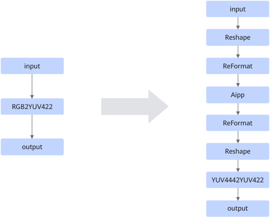

# RGB2YUV422FusionPass

## Description

Splits RGB2YUV422 into two operators: Aipp+YUV4442YUV422, because the RGB2YUV422 operator and the `load_image` operator in this operator support different product forms.

## Constraints

- The input shape of RGB2YUV422 is three dimensions, and the last dimension must be 3.
- After the RGB2YUV422 input is reshaped into the NHWC format, ensure that H and W are less than or equal to 4096.
- The value range of the first two dimensions of the input shape of RGB2YUV422 is `[2, 4096]`.

## Applicable Products

<!-- npu="910b" id1 -->
Atlas A2 training products/Atlas A2 inference products
<!-- end id1 -->

<!-- npu="A3" id2 -->
Atlas A3 training products/Atlas A3 inference products
<!-- end id2 -->
