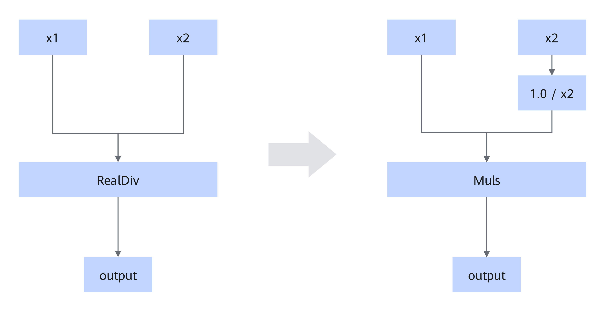

# RealDiv2MulsFusionPass

## Description

When the data type of the second input of the RealDiv operator is scalar, this pattern converts the operator into the Muls operator, and the second input becomes the reciprocal of the original input.

## Constraints

- The input x2 must be either a scalar or of type float32, and it cannot be a tensor.
- The value of x2 must be greater than 1 × 10−6.

## Applicable Products

<!-- npu="310p" id1 -->
Atlas inference products
<!-- end id1 -->

<!-- npu="310b" id2 -->
Atlas 200I/500 A2 inference products
<!-- end id2 -->

<!-- npu="910" id3 -->
Atlas training products
<!-- end id3 -->

<!-- npu="910b" id4 -->
Atlas A2 training products/Atlas A2 inference products
<!-- end id4 -->
