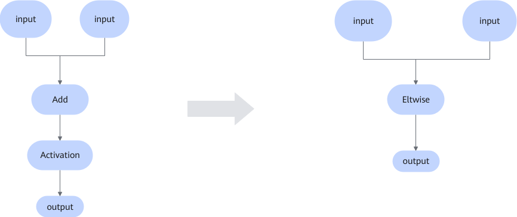
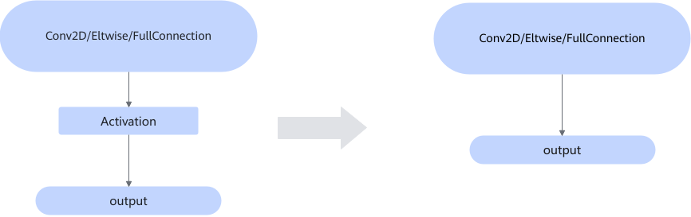

# ReluFusionPass

## Description

In the Caffe framework, the fusion matches the following specific graph structure. After the matching is successful, the fusion is converted into an instruction to complete the computation of the activation function.

**Structure 1**

**Structure 2**

## Constraints

The input of the Add operator must be Convolution, Activation, FusionBatchNorm, BatchNorm, Pooling, or Eltwise.

The **Mode** attribute of Activation is set to **Relu**.

## Applicable Products

<!-- npu="310b" id3 -->
Atlas 200I/500 A2 inference products
<!-- end id3 -->

<!-- npu="310p" id4 -->
Atlas inference products
<!-- end id4 -->

<!-- npu="910" id5 -->
Atlas training products
<!-- end id5 -->Atlas training products

<!-- npu="910b" id1 -->
Atlas A2 training products/Atlas A2 inference products
<!-- end id1 -->

<!-- npu="A3" id2 -->
Atlas A3 training products/Atlas A3 inference products
<!-- end id2 -->
