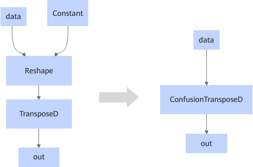

# ReshapeTransposeFusionPass

## Description

Fuses the Reshape and TransposeD operators that fit the graph fusion pattern into the ConfusionTransposeD operator.

## Constraints

For the Reshape node:

- Fusion is not performed if the input shape is dynamic.
- Fusion is not performed if the input dimension is 1 and the shape is dynamic.
- Fusion is not performed if the input dimension is 1 and the shape is not divisible by 16.
- Fusion is not performed if the input dimension is greater than or equal to 2 and either of the last two dimensions has a dynamic shape.
- Fusion is not performed if the input dimension is greater than or equal to 2 and either of the last two dimensions is not divisible by 16.
- Fusion is not performed if the input is an empty tensor.

For TransposeD:

- Supported input data types: float16, float32, int8, int16, int32, int64, uint8, uint16, uint32, and uint64.
- The input dimension must not exceed 8, and the input shape must match the output shape.

- Fusion is not performed if the output shape is dynamic.
- Fusion is not performed if the output dimension is 1 and the shape is dynamic.
- Fusion is not performed if the output dimension is 1 and the shape is not divisible by 16.
- Fusion is not performed if the output dimension is greater than or equal to 2 and either of the last two dimensions has a dynamic shape.
- Fusion is not performed if the output dimension is greater than or equal to 2 and either of the last two dimensions is not divisible by 16.

## Applicable Products

<!-- npu="910b" id1 -->
Atlas A2 training products/Atlas A2 inference products
<!-- end id1 -->
