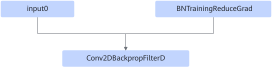

# Resnet50DbnDwFusionPass

## Description

Fuses the BNTrainingReduceGrad+Conv2DBackpropFilterD operators into the FusedDbnDw operator.

After:

## Constraints

Non-common fusion. This fusion is performed only for specific shapes on the ResNet-50 network.

## Applicable Products

<!-- npu="910" id1 -->
Atlas training products
<!-- end id1 -->
