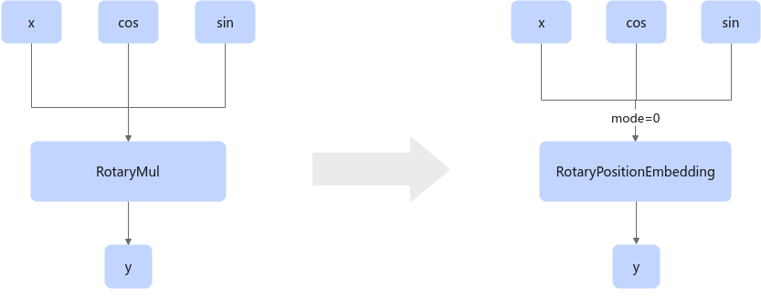

# RotaryMul2RotaryPositionEmbeddingFusionPass

## Description

Fuses the RotaryMul operator into the RotaryPositionEmbedding operator.

## Constraints

You are advised not to disable this pattern. Otherwise, the RotaryMul Ascend IR function will be unavailable.

## Applicable Products

<!-- npu="950" id1 -->
950PR/950DT
<!-- end id1 -->
